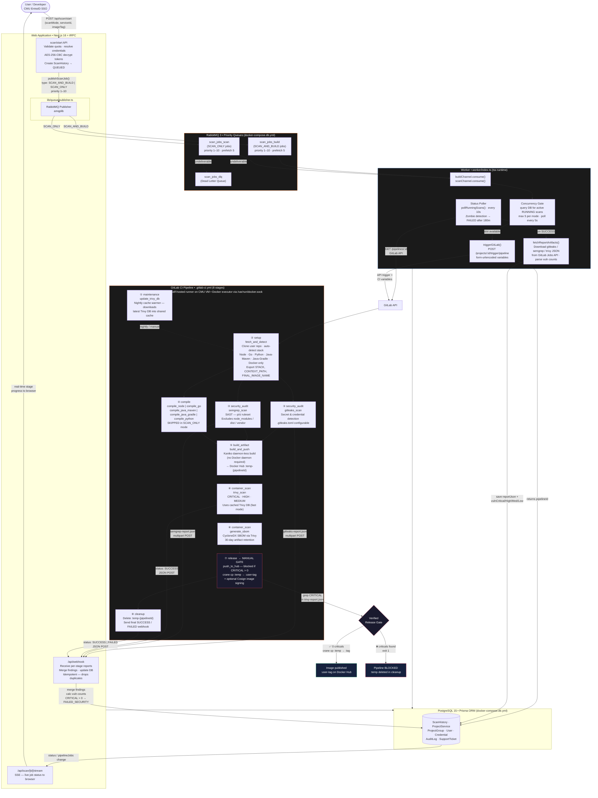

# VisScan

> **A full-stack DevSecOps scanning platform — web dashboard + automated GitLab CI pipeline**

VisScan is an open-source platform that lets developers trigger, monitor, and audit security scans for their containerised services through a web UI. When a scan is started, a job is enqueued via RabbitMQ, a TypeScript worker picks it up and triggers a dedicated GitLab CI pipeline on a self-hosted runner, and results flow back in real time through webhooks and a status poller. Every scan runs Gitleaks (secret detection), Semgrep (SAST), and Trivy (container + OS vulnerabilities) — with a **Verified Release Gate** that blocks promotion of any image carrying unresolved CRITICAL findings.

[](LICENSE)


---

## ⚠️ For Technical Reviewers & Recruiters

**This platform cannot be run locally out-of-the-box, and that is by design.**

VisScan depends on two pieces of institutional infrastructure that are not publicly replicable:

1. **CMU EntraID (OAuth2)** — Authentication is handled exclusively through Chiang Mai University's Microsoft EntraID identity provider. The callback URL is hard-wired to the production deployment at `visscan.cpe.eng.cmu.ac.th`. There is no public OAuth client ID available for external use.

2. **Self-hosted GitLab Runner (CMU VM)** — The CI pipeline is triggered via a GitLab Trigger Token pointing to a specific GitLab project running on a university-provisioned virtual machine. The runner mounts the host Docker socket (`/var/run/docker.sock`) and requires the VM's resources to execute 8-stage pipelines with concurrent scanning jobs.

**What to review instead:**

- The **Architecture Diagram** below gives a precise, code-accurate picture of every data flow.
- The **Screenshots** section (sourced from `public/landing/`) shows the real UI in production.
- The **source code** itself — `worker/index.ts`, `lib/queue/publisher.ts`, `.gitlab-ci.yml`, `app/api/webhook/route.ts`, and `prisma/schema.prisma` — are the most representative files for technical evaluation.

---

## 🖥️ Local Demo (HR / Non-Technical Preview)

> ดูหน้าตา UI และ flow ของระบบได้ทันที **โดยไม่ต้องใช้ CMU Account หรือ GitLab**

**ข้อกำหนด:** ติดตั้ง [Docker Desktop](https://www.docker.com/products/docker-desktop/) แล้ว

```bash
# macOS / Linux
cp .env.local.example .env.local

# Windows (PowerShell)
copy .env.local.example .env.local

# Build และ start ทุก services
docker compose -f docker/docker-compose.local.yml up --build
```

เปิดเบราว์เซอร์ที่ **http://localhost:3000** แล้ว login ด้วย:

| Field    | Value                |
|----------|----------------------|
| Email    | `SuperAdmin@VisScan` |
| Password | `LocalDemo1234!`     |

> ดูคู่มือฉบับเต็มได้ที่ [LOCAL_DEMO_GUIDE.md](./LOCAL_DEMO_GUIDE.md)

---

## Architecture

VisScan is composed of four runtime components that work together:

| Component | Technology | Role |
|---|---|---|
| **Web App** | Next.js 16 + tRPC + NextAuth | Dashboard, scan management, admin panel |
| **Worker** | Node.js (tsx) | RabbitMQ consumer; triggers GitLab CI pipelines |
| **GitLab CI Pipeline** | GitLab CI + self-hosted Docker runner (CMU VM) | Clones repo, compiles, builds image, scans, gates release |
| **Database** | PostgreSQL 15 + Prisma ORM | Persists users, projects, scan history, findings |



---

## Key Features

**Dual scan modes.** `SCAN_AND_BUILD` clones the repo, auto-detects the stack (Node, Go, Python, Java/Maven, Java/Gradle, or existing Dockerfile), compiles if necessary, builds with Kaniko, then scans the resulting container image. `SCAN_ONLY` runs Gitleaks and Semgrep on source code without building — useful for rapid secret and SAST checks without consuming build resources.

**Auto-stack detection.** The `fetch_and_detect` stage inspects the cloned repository for `package.json`, `go.mod`, `pom.xml`, `build.gradle`, `requirements.txt`, or a `Dockerfile` and configures the correct compile and build path automatically — no user configuration required.

**Daemon-less Kaniko builds.** Container images are built using Kaniko, which does not require a Docker daemon. The GitLab runner mounts `/var/run/docker.sock` from the host VM for runner-level Docker access, but Kaniko itself operates independently — building and pushing images without elevated daemon privileges. Named `--chown` flags are patched to numeric UID/GID at build time for full Kaniko compatibility.

**Dual-lane priority queue.** RabbitMQ maintains two separate priority queues — `scan_jobs_build` and `scan_jobs_scan` — each with `prefetch(5)`, supporting up to 10 concurrent pipeline slots. A worker-side concurrency gate queries the database before consuming each message to prevent runner oversubscription on the CMU VM.

**Verified Release Gate.** The `push_to_hub` job is manual-trigger only, and checks the Trivy report for CRITICAL severity findings before promoting the temporary image (`:temp-{pipelineId}`) to the user's target tag. If any criticals exist, the job exits with code 1 and the cleanup stage deletes the temporary image automatically.

**SBOM generation.** After every successful build, `generate_sbom` produces a CycloneDX-format Software Bill of Materials using Trivy, stored as a 30-day pipeline artifact for supply-chain audit purposes.

**Cosign image signing.** An optional `sign_image` stage signs the promoted image with Sigstore Cosign if `COSIGN_PRIVATE_KEY` is set as a CI/CD variable — providing cryptographic provenance for every released image.

**Institutional SSO with approval workflow.** Authentication is handled via CMU EntraID (Microsoft OAuth2). New users enter a `PENDING` state and require admin approval before gaining access. Admins can bulk-approve users and set per-user project quotas from the admin panel.

**AES-256-CBC credential encryption.** All stored Git tokens and Docker credentials are encrypted with AES-256-CBC before being written to the database, and decrypted in-memory only at the moment a scan job is constructed.

**Real-time scan progress.** The web app streams pipeline job updates (stage name, status, duration) back to the browser via Server-Sent Events. Updates arrive through both the webhook path (per-stage, during the pipeline) and the 10-second status poller (fallback).

**Fault-tolerant result ingestion.** Webhooks and the poller are fully independent paths. Webhook events are idempotent — duplicate stage events are detected and dropped. The poller includes zombie-detection logic that auto-fails any scan stuck in `RUNNING` state beyond 180 minutes.

**OpenTelemetry tracing.** The web app is instrumented with OpenTelemetry (OTLP HTTP exporter). Tracing is disabled by default and activates only when `OTEL_EXPORTER_OTLP_ENDPOINT` is set, making it production-safe.

---

## Screenshots

### Dashboard


### Scan Pipeline — Live Stage Progress


### Scan Results


### Scan History


### Compare Two Scans


### Docker Template Override


---

## Tech Stack

| Layer | Technology |
|---|---|
| Frontend | Next.js 16, React 18, Tailwind CSS, tRPC, TanStack Query |
| Auth | NextAuth v4, CMU EntraID (Microsoft OAuth2 via proxy), bcryptjs, AES-256-CBC credential encryption |
| Backend API | Next.js Route Handlers, Zod validation, structured audit logging |
| Worker | Node.js + tsx, amqplib, Axios |
| Message Broker | RabbitMQ 3 (dual priority queues + dead-letter queue) |
| Database | PostgreSQL 15, Prisma ORM |
| CI Pipeline | GitLab CI/CD, self-hosted Docker runner on CMU VM |
| Container Build | Kaniko (daemon-less, no Docker daemon required) |
| SAST | Semgrep 1.100 (p/ci ruleset) |
| Secret Detection | Gitleaks v8.18 (configurable `.gitleaks.toml`) |
| Container Scan | Trivy 0.53 (nightly cached DB via maintenance job) |
| SBOM | Trivy (CycloneDX format) |
| Image Signing | Sigstore Cosign (optional, via CI/CD variable) |
| Image Registry | Docker Hub |
| Observability | OpenTelemetry (OTLP HTTP exporter, opt-in) |
| Deployment | Docker Compose (`docker-compose.prod.yml`, `docker-compose.db.yml`, `docker-compose.runner.yml`) |

---

## Project Structure

```
VisScan/
├── app/                          # Next.js App Router
│   ├── api/
│   │   ├── scan/start/           # POST — enqueue a scan job
│   │   ├── scan/[id]/stream/     # GET  — SSE live pipeline status
│   │   ├── webhook/              # POST — receives GitLab CI stage reports
│   │   ├── admin/                # Admin: users, quotas, scan history, settings
│   │   └── auth/cmu-proxy/       # CMU EntraID OAuth2 redirect proxy
│   ├── dashboard/                # Main project/service dashboard
│   ├── scan/                     # Scan pages: build, scan-only, history, compare
│   └── admin/                    # Admin UI: users, history, templates
│
├── worker/
│   └── index.ts                  # RabbitMQ consumer + GitLab trigger + status poller
│
├── lib/
│   ├── queue/
│   │   ├── publisher.ts          # RabbitMQ publisher (amqplib)
│   │   └── types.ts              # ScanJob, JobResult, queue name constants
│   ├── auth.ts                   # NextAuth config — CMU EntraID + credentials provider
│   ├── crypto.ts                 # AES-256-CBC encrypt/decrypt for stored tokens
│   ├── quotaManager.ts           # Per-user quota + ghost-job detection
│   ├── logger.ts                 # Structured logger + DB audit log
│   └── scanConfig.ts             # Retention config (5 scans/service, 365-day max)
│
├── prisma/
│   └── schema.prisma             # User · Credential · ProjectGroup · ProjectService
│                                 # ScanHistory · AuditLog · SupportTicket
│
├── docker/
│   ├── Dockerfile                # Multi-stage Next.js production image
│   ├── Dockerfile.worker         # Worker image (tsx runtime)
│   ├── Dockerfile.local          # Local demo image (development mode, no CMU OAuth)
│   ├── docker-compose.prod.yml   # web + worker services
│   ├── docker-compose.local.yml  # Local demo: all services, no external dependencies
│   ├── docker-compose.db.yml     # postgres + rabbitmq
│   └── docker-compose.runner.yml # GitLab runner (mounts /var/run/docker.sock)
│
└── .gitlab-ci.yml                # 8-stage CI pipeline definition
```

---

## CI Pipeline Stage Reference

| Stage | Job(s) | Runs when | Description |
|---|---|---|---|
| `maintenance` | `update_trivy_db` | Schedule / manual | Downloads latest Trivy vulnerability DB into shared runner cache |
| `setup` | `fetch_and_detect` | Always | Clones target repo · auto-detects stack · exports env vars via `dotenv` artifact |
| `security_audit` | `gitleaks_scan`, `semgrep_scan` | Always (parallel) | Secret detection + SAST; each POSTs its JSON report to `/api/webhook` mid-pipeline |
| `compile` | `compile_node/go/python/java_*` | `SCAN_AND_BUILD` only | Compiles source; Java JARs cached between stages via GitLab cache |
| `build_artifact` | `build_and_push` | `SCAN_AND_BUILD` only | Kaniko builds and pushes `:temp-{pipelineId}` to Docker Hub |
| `container_scan` | `trivy_scan`, `generate_sbom` | `SCAN_AND_BUILD` only | CVE scan (cached DB) + CycloneDX SBOM generation |
| `release` | `push_to_hub` *(manual)*, `sign_image` | `SCAN_AND_BUILD` only | **Verified Release Gate** — blocks if CRITICAL > 0; promotes image; optional Cosign signing |
| `cleanup` | *(always)* | Always | Deletes `:temp` image from Docker Hub; sends final webhook |

---

## Infrastructure Setup

The production deployment uses three separate Docker Compose files:

```bash
# 1. Start the database and message broker
docker compose -f docker/docker-compose.db.yml up -d

# 2. Register and start the GitLab runner on the same VM
docker compose -f docker/docker-compose.runner.yml up -d
# Then register: docker exec -it gitlab-runner gitlab-runner register

# 3. Start the web app and worker
docker compose -f docker/docker-compose.prod.yml up -d
```

The runner uses the Docker executor with `/var/run/docker.sock` mounted, allowing pipeline jobs to pull and run tool images (Kaniko, Trivy, Semgrep, Gitleaks) directly on the host VM.

---

## Environment Variables

| Variable | Required | Description |
|---|---|---|
| `DATABASE_URL` | ✅ | PostgreSQL connection string |
| `RABBITMQ_URL` | ✅ | RabbitMQ AMQP URL |
| `GITLAB_PROJECT_ID` | ✅ | GitLab project ID hosting `.gitlab-ci.yml` |
| `GITLAB_TRIGGER_TOKEN` | ✅ | GitLab pipeline trigger token |
| `GITLAB_TOKEN` | ✅ | Personal access token for Jobs API (artifact download + status polling) |
| `GITLAB_API_URL` | ✅ | GitLab API base URL |
| `NEXTAUTH_SECRET` | ✅ | Random secret for NextAuth JWT signing |
| `NEXTAUTH_URL` | ✅ | Public base URL of the web app |
| `ENCRYPTION_KEY` | ✅ | Exactly 32 characters — AES-256-CBC key for credential encryption |
| `CMU_ENTRAID_CLIENT_ID` | ✅ (prod) | CMU Microsoft EntraID OAuth client ID |
| `CMU_ENTRAID_CLIENT_SECRET` | ✅ (prod) | CMU Microsoft EntraID OAuth client secret |
| `CMU_ENTRAID_REDIRECT_URL` | ✅ (prod) | OAuth callback URL (must match EntraID registration) |
| `GITLAB_WEBHOOK_SECRET` | Optional | Shared secret for verifying incoming CI webhooks |
| `COSIGN_PRIVATE_KEY` | Optional | Sigstore Cosign private key for image signing |
| `OTEL_EXPORTER_OTLP_ENDPOINT` | Optional | OpenTelemetry collector endpoint (tracing opt-in) |
| `ADMIN_PASSWORD` | Optional | Password for the seeded admin account |

---

## Related Repository

| Repo | Description |
|---|---|
| [VisScan-gitlab-ci-template](https://github.com/Unlxii/VisScan-gitlab-ci-template) | Reusable `.gitlab-ci.yml` include template — integrate VisScan scanning into any GitLab project |

---

## License

MIT © [Ronnachai Sitthichoksathit](https://github.com/Unlxii) & [Kittiwat Yasarawan](https://github.com/Fittokung)
